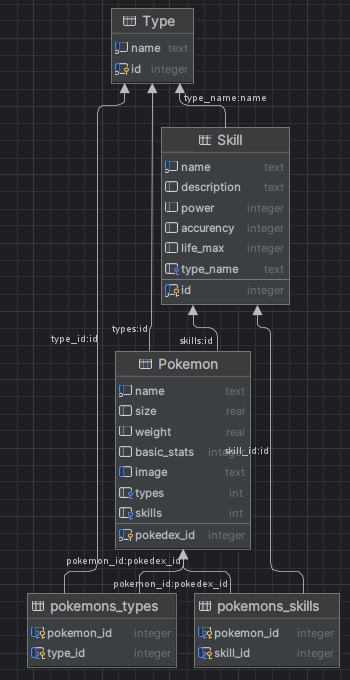

# fastapi-api-pokemon

Ce projet englobe une application API REST et une application Angular conçue pour répertorier des Pokémon et afficher 
leurs détails. L'API fournit des fonctionnalités CRUD permettant de paramétrer les Pokémon. Réalisé dans le cadre du 
module Python de ma formation, ce projet se décompose en plusieurs sections expliquées ci-dessous.

## Outils et technos utilisées

- Python : Nombreuses bibliothèques disponibles pour créer une API
- FastAPI : Utiliser pour créer des API REST, simple à prendre en main et efficace
- SQLite : Solution de base de données légère
- PyCharm : Excellente prise en charge du Python
- GitKraken : Client Git qui facilite le versioning
- Postman : Outils de tests d'API
- DB Brower : Logiciel de gestion de base de données SQLite
- Angular : Framework TypeScript facile à initialiser

## Installation en local

### Repository

Clonage du répertoire
```bash
git clone https://github.com/Borloo/fastapi-api-pokemon
```

### API

#### Pré-requis

- Python

1. Configuration de l'environnement vituel
```bash
cd api
python -m venv app-venv
app-venv\Scripts\activate
```
2. Installation des dépendances
```bash
pip install -r .\requirements.txt
```
3.  Lancement de l'API
```bash
uvicorn app.main:app
```

### Front

#### Pré-requis

- Node.js

1. Installation des dépendances
```bash
cd fastapi-api-python\front-pokemon
npm install
```

2. Lancer le serveur en local
```bash
ng serve 
```

### Extension Chrome

Pour assurer la communication entre l'API et le Frontend, une extension Chrome est requise. Cette extension permet 
d'autoriser les requêtes locales sur le navigateur.<br>
Voici le [lien](https://chrome.google.com/webstore/detail/allow-cors-access-control/lhobafahddgcelffkeicbaginigeejlf)

## Base de données



1. Type
```sql
CREATE TABLE "Type" (
	"id"	INTEGER NOT NULL UNIQUE,
	"name"	TEXT NOT NULL UNIQUE,
	PRIMARY KEY("id" AUTOINCREMENT)
);
```
2. Skill
```sql
CREATE TABLE "Skill" (
	"id"	INTEGER NOT NULL UNIQUE,
	"name"	TEXT NOT NULL UNIQUE,
	"description"	TEXT,
	"power"	INTEGER,
	"accurency"	INTEGER,
	"life_max"	INTEGER COLLATE UTF16CI,
	"type_name"	TEXT COLLATE UTF16CI,
	PRIMARY KEY("id" AUTOINCREMENT),
	FOREIGN KEY("type_name") REFERENCES "Type"("name")
);
```
3. Pokemon
```sql
CREATE TABLE "Pokemon" (
	"pokedex_id"	INTEGER NOT NULL UNIQUE,
	"name"	TEXT NOT NULL UNIQUE,
	"size"	REAL,
	"weight"	REAL,
	"basic_stats"	INTEGER,
	"image"	TEXT UNIQUE,
	"types"	INT ,
	"skills"	INT ,
	FOREIGN KEY("types") REFERENCES "Type"("id"),
	FOREIGN KEY("skills") REFERENCES "Skill"("id"),
	PRIMARY KEY("pokedex_id" AUTOINCREMENT)
);
```
4. pokemons_types
```sql
CREATE TABLE "pokemons_types" (
	"pokemon_id"	INTEGER,
	"type_id"	INTEGER,
	FOREIGN KEY("pokemon_id") REFERENCES "Pokemon"("pokedex_id"),
	FOREIGN KEY("type_id") REFERENCES "Type"("id"),
	PRIMARY KEY("pokemon_id","type_id")
);
```
5. pokemons_skills
```sql
CREATE TABLE "pokemons_skills" (
	"pokemon_id"	INTEGER,
	"skill_id"	INTEGER,
	PRIMARY KEY("pokemon_id","skill_id"),
	FOREIGN KEY("pokemon_id") REFERENCES "Pokemon"("pokedex_id"),
	FOREIGN KEY("skill_id") REFERENCES "Skill"("id")
);
```

## L'implémentation

### API

*Exemple avec l'entité Pokemon*

1. models.py
```python
pokemons_types = Table(
    "pokemons_types",
    Base.metadata,
    Column("pokemon_id", Integer, ForeignKey("Pokemon.pokedex_id"), primary_key=True),
    Column("type_id", Integer, ForeignKey("Type.id"), primary_key=True)
)


pokemons_skills = Table(
    "pokemons_skills",
    Base.metadata,
    Column("pokemon_id", Integer, ForeignKey("Pokemon.pokedex_id"), primary_key=True),
    Column("skill_id", Integer, ForeignKey("Skill.id"), primary_key=True)
)


class Pokemon(Base):
    __tablename__ = "Pokemon"

    pokedex_id = Column(Integer, unique=True, primary_key=True)
    name = Column(String, unique=True, nullable=False)
    size = Column(Float)
    weight = Column(Float)
    basic_stats = Column(Integer)
    image = Column(Text, unique=True)

    types = relationship("Type", secondary=pokemons_types, back_populates="pokemons")
    skills = relationship("Skill", secondary=pokemons_skills, back_populates="pokemons")
```
2. schemas.py
```python
class PokemonBase(BaseModel):
    pokedex_id: int
    name: str
    size: float
    weight: float
    basic_stats: float
    image: str
    types: List[int]
    skills: List[int]


class PokemonCreate(PokemonBase):
    pass


class Pokemon(PokemonBase):
    types: List[Type] = []
    skills: List[Skill] = []

    class Config:
        orm_mode = True
```
3. crud.py
```python
def create_pokemon(db: Session, pokemon: schemas.PokemonCreate):
    # Checks :
    # - Pokemon with a same name exist
    # - Pokemon with a same pokedex id exist
    # - Types exist
    # - Skills exist
    db_pokemon_name = get_pokemon_by_name(db, pokemon.name)
    db_pokemon_id = get_pokemon_by_id(db, pokemon.pokedex_id)
    db_types = get_types_by_pokemon(db, pokemon.types)
    db_skills = get_skills_by_pokemon(db, pokemon.skills)
    if db_pokemon_name or db_pokemon_id or not db_types or not db_skills:
        return None
    db_pokemon: schemas.PokemonCreate = models.Pokemon(**pokemon.model_dump(exclude={"types", "skills"}))
    # Insert object, not ids
    db_pokemon.types = db_types
    db_pokemon.skills = db_skills
    db.add(db_pokemon)
    db.commit()
    db.refresh(db_pokemon)
    return db_pokemon


def delete_pokemon_by_id(db: Session, pokedex_id: int):
    # Check pokedex id pokemon exist
    db_pokemon = get_pokemon_by_id(db, pokedex_id)
    if db_pokemon:
        db.delete(db_pokemon)
        db.commit()
        return db_pokemon
    return None


def update_pokemon_by_id(db: Session, pokedex_id: int, pokemon: schemas.PokemonCreate):
    # Checks
    # Pokedex id pokemon exist
    # Types exist
    # Skills exist
    db_pokemon = get_pokemon_by_id(db, pokedex_id)
    db_types = get_types_by_pokemon(db, pokemon.types)
    db_skills = get_skills_by_pokemon(db, pokemon.skills)
    if db_pokemon or not db_types or not db_skills:
        # refresh all attributs
        db_pokemon.name = pokemon.name
        db_pokemon.size = pokemon.size
        db_pokemon.weight = pokemon.weight
        db_pokemon.basic_stats = pokemon.basic_stats
        db_pokemon.image = pokemon.image
        # Insert objects, not ids
        db_pokemon.types = db_types
        db_pokemon.skills = db_skills
        db.commit()
        db.refresh(db_pokemon)
        return db_pokemon
    return None
```
4. main.py
```python
@app.post("/api/pokemon", response_model=schemas.Pokemon)
def create_pokemon(pokemon: schemas.PokemonCreate, db: Session = Depends(get_db)):
    db_pokemon = crud.create_pokemon(db, pokemon)
    if db_pokemon:
        return db_pokemon
    raise HTTPException(status_code=404, detail="Pokemon already exist")


@app.delete("/api/pokemon/{pokedex_id}", response_model=schemas.Pokemon)
def delete_pokemon(pokedex_id: int, db: Session = Depends(get_db)):
    deleted_pokemon = crud.delete_pokemon_by_id(db, pokedex_id)
    if deleted_pokemon:
        return deleted_pokemon
    raise HTTPException(status_code=404, detail="Pokemon not found")


@app.put("/api/pokemon/{pokedex_id}", response_model=schemas.Pokemon)
def update_pokemon(pokedex_id: int, pokemon: schemas.PokemonCreate, db: Session = Depends(get_db)):
    db_pokemon = crud.update_pokemon_by_id(db, pokedex_id, pokemon)
    if db_pokemon:
        return db_pokemon
    raise HTTPException(status_code=404, detail="Pokemon not found")
```

### Front

1. Models
```typescript
export interface Type {
  id: number;
  name: string;
}
export interface Skill{
  id: number;
  name: string;
  description: string;
  power: number;
  accurency: number;
  life_max: number;
  type_name: string;
}
export interface Pokemon{
  pokedex_id: number;
  name: string;
  size: number;
  weight: number;
  basic_stats: number;
  image: string;
  types: Type[];
  skills: Skill[];
}
```

1. pokemon.service.ts
```typescript
export class PokemonService {

  private pokemonsUrl: string = "http://localhost:8000/api/pokemons";

  constructor(private http: HttpClient) { }

  getPokemons(): Observable<Pokemon[]> {
    return this.http.get<Pokemon[]>(this.pokemonsUrl).pipe(
      tap(data => console.log('All', JSON.stringify(data))),
      catchError(this.handleError)
    )
  }

  private handleError(err: HttpErrorResponse): Observable<never>{
    let errorMessage: string = "";
    if (err.error instanceof ErrorEvent){
      errorMessage = `Server return code ${err.status}, error message is: ${err.message}`;
    }
    console.error(errorMessage)
    return throwError(() => errorMessage);
  }
}
```

2. pokemons.component.ts
```typescript
export class PokemonsComponent implements OnInit, OnDestroy{

  errorMessage: string = '';
  sub!: Subscription;

  pokemons: Pokemon[] = [];

  pokemon!: Pokemon;

  constructor(private pokemonService: PokemonService) { }

  ngOnDestroy(): void {
    this.sub.unsubscribe();
  }

  ngOnInit(): void {
    this.sub = this.pokemonService.getPokemons().subscribe({
      next: pokemons => {
        this.pokemons = pokemons;
      },
      error: err => this.errorMessage = err
    });
  }

  setPokemon(pokemon: Pokemon): void{
    this.pokemon = pokemon;
  }
}
```

3. pokemons.component.html
```html
...
<table class="table" *ngIf="pokemons.length">
<thead>
  <tr>
    <th>Pokedex ID</th>
    <th>Name</th>
    <th>Size (cm)</th>
    <th>Weight (kg)</th>
    <th>Basic stats</th>
    <th>Types</th>
    <th>Skills</th>
    <th>Actions</th>
  </tr>
</thead>
<tbody>
  <tr class="pokemon-container" *ngFor="let pokemon of pokemons">
    <td>{{pokemon.pokedex_id}}</td>
    <td>{{pokemon.name}}</td>
    <td>{{pokemon.size}}</td>
    <td>{{pokemon.weight}}</td>
    <td>{{pokemon.basic_stats}}</td>
    <td>
      <span class="badge bg-success" *ngFor="let type of pokemon.types">
        {{type.name}}
      </span>
    </td>
    <td>
      <span class="badge bg-primary" *ngFor="let skill of pokemon.skills">
        {{skill.name}}
      </span>
    </td>
    <td>
      <button (click)="setPokemon(pokemon)" type="button" class="btn btn-primary" data-bs-toggle="modal" data-bs-target="#exampleModal">
        Show
      </button>
    </td>
  </tr>
</tbody>
</table>
...
<div class="modal fade" id="exampleModal" tabindex="-1" aria-labelledby="exampleModalLabel" aria-hidden="true">
    <app-pokemon [pokemon]="pokemon"></app-pokemon>
</div>
```

4. pokemon.component.ts
```typescript
export class PokemonComponent {
  @Input() pokemon!: Pokemon;

}
```

5. pokemon.component.html
```html
...
  <div class="container-fluid center">
    
  </div>
  <div class="table-responsive">
    <div class="table-responsive">
      <table class="table">
        <thead>
        <tr>
          <th>Size (cm)</th>
          <th>Weight (kg)</th>
          <th>Basic stats</th>
        </tr>
        </thead>
        <tbody>
        <tr>
          <td>{{pokemon.size}}</td>
          <td>{{pokemon.weight}}</td>
          <td>{{pokemon.basic_stats}}</td>
        </tr>
        </tbody>
      </table>
    </div>
  </div>
  <h4>Skills</h4>
  <div class="table-responsive">
    <table class="table">
      <thead>
        <tr>
          <th>Name</th>
          <th>Description</th>
          <th>Power</th>
          <th>Accuracy</th>
          <th>Life maw</th>
          <th>Type</th>
        </tr>
      </thead>
      <tbody>
        <tr *ngFor="let skill of pokemon.skills">
          <td>{{skill.name}}</td>
          <td>{{skill.description}}</td>
          <td>{{skill.power}}</td>
          <td>{{skill.accurency}}</td>
          <td>{{skill.life_max}}</td>
          <td><span class="badge bg-success">{{skill.type_name}}</span></td>
        </tr>
      </tbody>
    </table>
  </div>
...
```

## Tester l'API

Comme présenter au début, pour tester ce projet il est possible d'utiliser Postman, un outil très pratique qui permet d'essayer les différentes requêtes.<br>
Vous trouverez ici la [documentation de l'API Pokemon](https://documenter.getpostman.com/view/30768194/2s9YXfcih5)

Sinon directement en lancant le front de l'application qui permet de visualiser les pokemons.

Maxime Etcheverria